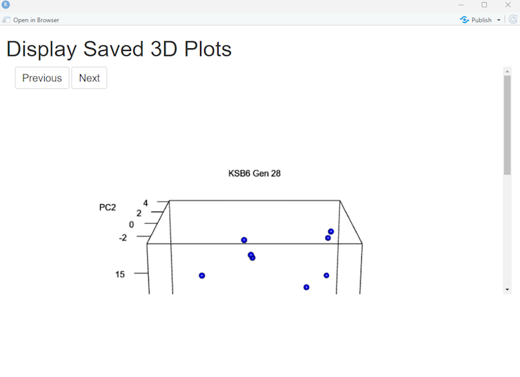
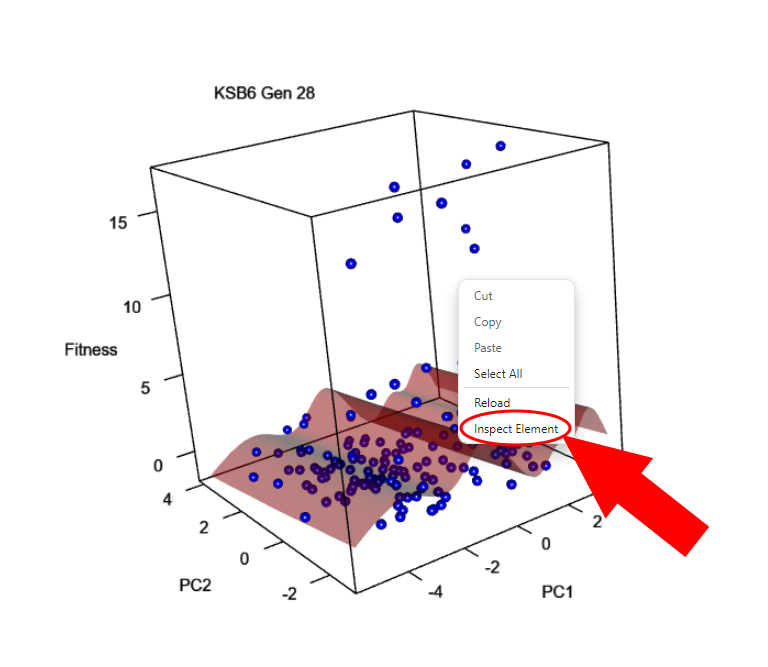
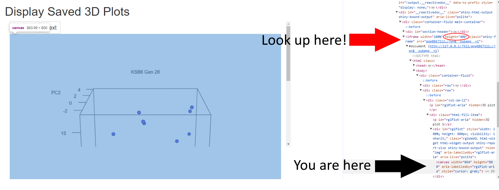
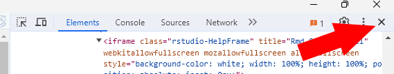

# FitnessLandscapeViz
This repo includes R scripts used for visualizing fitness landscapes, along with examples and test data.

## Included Scripts
*DataPrep.R*: This file includes an example of how to prepare data for use in the included *DisplayPlots* Shiny app. The end of this file includes a loop implementation for creating plots for multiple generations within one replicate.

*DisplayPlots.Rmd*: This file includes a Shiny app for viewing 3D fitness landscape plots saved using *DataPrep.R*.

## Running Included Scripts with Example Data
NOTE: The file name and folder references in these scripts assume that the working directory is "FitnessLandscapeViz" as cloned from this repo.

*DataPrep.R* includes two different implementations with example data: one with a single replicate/generation pair ("Single Implementation" header in the file) and one with a single replicate over multiple generations ("Loop Implementation" header in the file). 

*DisplayPlots.Rmd* requires some additional work to run properly. First, open *DisplayPlots.Rmd* in RStudio and ensure that the "prefix" variable matches the first part of the file names that you would like to visualize in the ./Data directory. Next, click "Run Document" and a pop-up should appear that looks like this:

One thing that you should notice when the Shiny app opens is that there is a scroll bar and that the full 3D plot isn't displaying properly even when the window appears like it should be large enough. I tried to add CSS to the Shiny app that would change the height of the iframe with the shiny-frame class to 1000, but I can't seem to make it work. A work-around that I use is to right-click on the 3D plot and click "Inspect Element"

Once you've clicked "Inspect Element," you will see the developer console in the screenshot below. If you right-clicked on the 3D plot, it will highlight the part of the HTML code next to the "You are here" arrow in the screenshot. If you look further up in the code, you will see `<iframe width="100%" height="400" class="shiny-frame" src="app3e7073f31c455867c4a2a29e38f2c922/?w=&amp;__subapp__=1"></iframe>`

In the chunk of code that says `<iframe width="100%" height="400" class="shiny-frame" src="app3e7073f31c455867c4a2a29e38f2c922/?w=&amp;__subapp__=1"></iframe>`, change `height="400"` to `height="1000"` by double-clicking on "400" and typing in "1000" and then hit the Enter key on your keyboard. You can now close out of the developer console by clicking on the "X" underneath the main Shiny App "X"

Once you've done that, you will be able to click and drag the 3D plot to view it from any angle you'd like! If you've chosen a file prefix that is shared by multiple files in the ./Data directory, you will also be able to click the "Next" and "Previous" buttons to see more 3D plots with the same file prefix.

## Runing Included Scripts with Custom Data
Once you've explored the scripts with the example data, you are ready to inject your own data! In order to use your own data, you should do the following things:

* Replace read.csv() function calls with your own file names
* Replace data filtering lines with ones that make sense for your own data (the example data uses "replicate", "Generation", and variable names that mostly mean something to my personal data)
* Replace the line for saving fitness values with the sensible column in your personal dataset
* Replace filename and plot_title variables in the plot saving code chunk with names that make sense for your data
